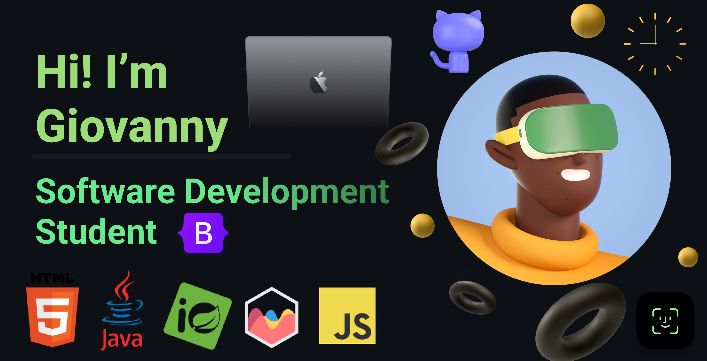

<!-- Banner o imagen de portada -->

  

<h1 align="center">👋 ¡Hola! Soy Giovanny Orozco</h1>

  <b>Desarrollador Full Stack Java • Backend API REST • Visualización de datos • MongoDB + Power BI</b>

## 🧰 Tecnologías que uso

  
  
  
  
  
  
  
  
  
  
  
  

---

## 👨‍💻 Sobre mí

Soy **Giovanny Orozco**, desarrollador especializado en construir soluciones sólidas con **Java + Spring Boot** en el backend y tecnologías como **MongoDB, Redis y Power BI** para el manejo y visualización de datos. Mi enfoque está en brindar plataformas eficientes, seguras y escalables.

---

## 🏆 Trofeos de GitHub

  

---

## 📊 Estadísticas de GitHub

  
  

---

## 🔥 Racha de contribuciones

  

---

## 📂 Repositorios destacados

- 🔧 [**ServiApp**]([https://github.com/Gaos-Orozco/ServiApp](https://github.com/cdelriot1121/Spring.ClassroomProject-SERVIAPP))  
  Plataforma para monitoreo de consumo de servicios públicos domiciliarios en Cartagena.  
  `Spring Boot`, `MongoDB`, `Chart.js`, `Power BI`

---

## 📫 Contacto

- [LinkedIn](https://www.linkedin.com/in/giovanny-orozco-2165b9206/) 

---

  

